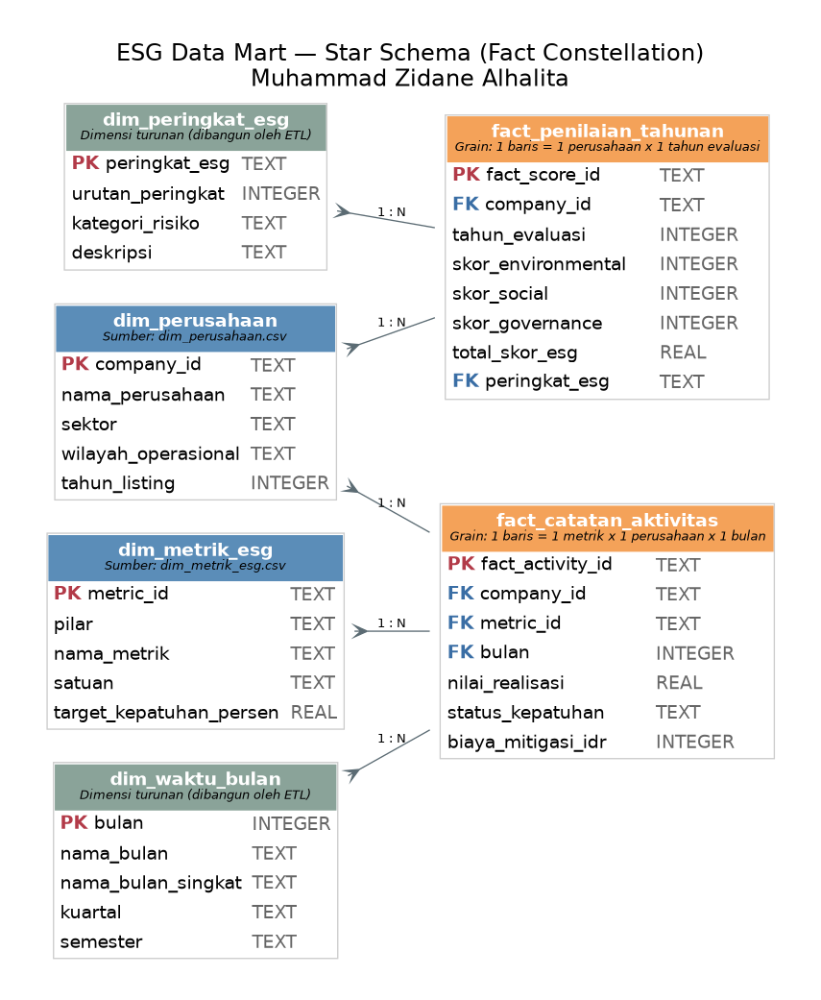

# 🌱 ESG Data Mart — Compliance & Performance Analytics

**Proyek portofolio data mart end-to-end**: mengubah 4 file CSV mentah menjadi database dimensional (star schema), lapisan SQL analitis, dan dashboard pelaporan interaktif untuk memantau kinerja dan kepatuhan ESG (*Environmental, Social, Governance*) dari 2.500 perusahaan.

Dibangun sebagai proyek portofolio untuk melamar posisi **Data Mart Intern**, sebagai bukti penerapan langsung: **IT, Database Programming, SQL, Management Information System (MIS), dan Reporting.**

**Penulis:** Muhammad Zidane Alhalita

---

## Daftar Isi

1. [Tentang Proyek](#tentang-proyek)
2. [Tech Stack](#tech-stack)
3. [Struktur Proyek](#struktur-proyek)
4. [Sumber Data](#sumber-data)
5. [Desain Data Mart (Star Schema)](#desain-data-mart-star-schema)
6. [Asumsi & Keterbatasan Data](#asumsi--keterbatasan-data)
7. [Proses ETL](#proses-etl)
8. [Lapisan SQL: Schema, Views, & Query Analitis](#lapisan-sql-schema-views--query-analitis)
9. [Cara Menjalankan Proyek](#cara-menjalankan-proyek)
10. [Dashboard Pelaporan](#dashboard-pelaporan)
    - [Opsi 1 — Dashboard Statis (HTML)](#opsi-1--dashboard-statis-html)
    - [Opsi 2 — Dashboard Interaktif (Streamlit)](#opsi-2--dashboard-interaktif-streamlit)
11. [Contoh Insight dari Data](#contoh-insight-dari-data)
12. [Pemetaan ke Kualifikasi Posisi](#pemetaan-ke-kualifikasi-posisi)
13. [Potensi Pengembangan Lanjutan](#potensi-pengembangan-lanjutan)

---

## Tentang Proyek

Sebuah lembaga penilai ESG mengumpulkan dua jenis data untuk 2.500 perusahaan publik di Indonesia:

1. **Penilaian tahunan** — skor ESG resmi (Environmental, Social, Governance) yang menentukan peringkat (AAA–BB).
2. **Catatan aktivitas bulanan** — realisasi ratusan metrik ESG spesifik (mis. efisiensi energi, kesetaraan gender, independensi dewan komisaris) beserta biaya mitigasi kepatuhan yang dikeluarkan.

Data ini datang dalam bentuk 4 file CSV terpisah, belum terstruktur untuk kebutuhan analisis lintas-dimensi (per sektor, per wilayah, per waktu, per pilar ESG). Proyek ini membangun **data mart** yang mengubah data mentah tersebut menjadi struktur dimensional siap-analisis, lengkap dengan:

- Skema database ternormalisasi secara dimensional (star schema / fact constellation)
- Pipeline ETL yang dapat diulang (repeatable) dan disertai pencatatan (logging) kualitas data
- Lapisan SQL analitis: reporting views + 15 query bisnis siap pakai
- Dashboard pelaporan visual (HTML/JS) yang membaca langsung dari hasil query

Seluruh proses — dari CSV mentah hingga dashboard — dapat direproduksi ulang hanya dengan menjalankan satu skrip Python (lihat [Cara Menjalankan Proyek](#cara-menjalankan-proyek)).

---

## Tech Stack

| Kebutuhan               | Tools yang Digunakan                          | Alasan                                                                 |
|--------------------------|------------------------------------------------|--------------------------------------------------------------------------|
| Database                 | **SQLite 3**                                    | Portabel (1 file), tanpa server, native di Python, cukup untuk skala data mart ini (~2.500 baris/tabel), sintaks SQL standar mudah diadaptasi ke PostgreSQL/MySQL |
| ETL                       | **Python 3** + `pandas`                         | Ekosistem data-engineering paling umum digunakan di industri              |
| Query & Reporting Layer   | **SQL murni** (DDL, Views, query analitis)      | Inti dari requirement "Database Programming" & "SQL"                     |
| Diagram ERD               | **Graphviz** (Python)                            | Menghasilkan diagram skema otomatis dari kode, bukan digambar manual      |
| Dashboard Statis           | **HTML/CSS/JavaScript + Chart.js**              | Ringan, tanpa dependensi server, dapat dibuka langsung dari file (`file://`) |
| Dashboard Interaktif       | **Streamlit + Plotly**                          | Query langsung ke database dengan filter live — mensimulasikan alat self-service BI |

---

## Struktur Proyek

```
esg-data-mart/
├── README.md                          <- Dokumen ini
├── requirements.txt                   <- Dependensi Python
├── .gitignore
├── .streamlit/
│   └── config.toml                    <- Tema visual dashboard Streamlit
│
├── app/
│   └── streamlit_app.py               <- Dashboard interaktif (live query ke database)
│
├── data/
│   ├── raw/                           <- 4 file CSV sumber (data mentah, tidak diubah)
│   │   ├── dim_perusahaan.csv
│   │   ├── dim_metrik_esg.csv
│   │   ├── fact_penilaian_tahunan.csv
│   │   └── fact_catatan_aktivitas.csv
│   └── esg_data_mart.db               <- Database SQLite hasil ETL (dibangun otomatis, lihat .gitignore)
│
├── sql/
│   ├── 01_create_schema.sql           <- DDL: CREATE TABLE, PK/FK, CHECK constraint, index
│   ├── 02_create_views.sql            <- Reporting views (lapisan semantik)
│   └── 03_analytical_queries.sql      <- 15 query analitis bernomor & berdokumentasi
│
├── etl/
│   ├── etl_pipeline.py                <- Skrip ETL utama (Extract -> Transform -> Load)
│   └── etl_log.txt                    <- Log hasil eksekusi ETL (dibuat otomatis)
│
├── scripts/
│   ├── generate_erd.py                <- Generator diagram ERD (Graphviz)
│   └── run_report.py                  <- Helper untuk menjalankan & mencetak semua query analitis
│
├── docs/
│   ├── data_dictionary.md             <- Kamus data lengkap (semua tabel & kolom)
│   ├── erd_diagram.png / .svg         <- Diagram ERD hasil generate
│   └── sample_query_results.md        <- Cuplikan hasil nyata dari 15 query analitis
│
└── reports/
    ├── dashboard.html                 <- Dashboard pelaporan interaktif (buka langsung di browser)
    └── dashboard_data.json            <- Data agregat yang di-embed ke dashboard
```

---

## Sumber Data

| File CSV                         | Baris | Kolom | Peran dalam Data Mart      |
|------------------------------------|------:|------:|------------------------------|
| `dim_perusahaan.csv`               | 2.500 | 5     | Dimensi perusahaan            |
| `dim_metrik_esg.csv`               | 2.500 | 5     | Dimensi metrik ESG            |
| `fact_penilaian_tahunan.csv`       | 2.500 | 8     | Fakta: skor ESG tahunan       |
| `fact_catatan_aktivitas.csv`       | 2.500 | 7     | Fakta: aktivitas & biaya bulanan |

Penjelasan kolom demi kolom, tipe data, dan aturan bisnis untuk setiap file tersedia lengkap di **[`docs/data_dictionary.md`](docs/data_dictionary.md)**.

Sebelum dimuat ke database, seluruh data melewati pemeriksaan kualitas otomatis oleh `etl/etl_pipeline.py` (lihat [Proses ETL](#proses-etl)). Hasil pemeriksaan pada data ini: **tidak ada nilai kosong, tidak ada baris duplikat, seluruh primary key unik, dan seluruh foreign key valid (referential integrity 100%)** — sehingga proses transformasi berfokus pada *pemodelan* (membentuk struktur dimensional) dibanding *pembersihan* data.

---

## Desain Data Mart (Star Schema)

Data mart ini menggunakan pola **fact constellation** (galaxy schema): dua tabel fakta yang berbagi dimensi `dim_perusahaan` yang sama.



```
dim_perusahaan ──┬──< fact_penilaian_tahunan >── dim_peringkat_esg
                  │        (grain: perusahaan x tahun)
                  │
                  └──< fact_catatan_aktivitas >── dim_metrik_esg
                           (grain: perusahaan x metrik x bulan)
                                    │
                                    └──< dim_waktu_bulan
```

**Keputusan desain penting:**

- **2 dimensi diambil apa adanya** dari sumber (`dim_perusahaan`, `dim_metrik_esg`) karena datanya sudah bersih dan sesuai grain yang dibutuhkan.
- **2 dimensi tambahan dibangun oleh ETL** (bukan berasal dari CSV mentah):
  - `dim_waktu_bulan` — dimensi kalender bulan (1–12), memungkinkan pelaporan pola musiman & pengelompokan per kuartal/semester tanpa mengulang logika `CASE WHEN` di setiap query.
  - `dim_peringkat_esg` — dimensi referensi yang memetakan setiap peringkat (`AAA`…`BB`) ke urutan numerik dan kategori risiko, agar laporan bisa diurutkan berdasarkan kualitas peringkat (bukan alfabet) dan dikelompokkan berdasarkan tingkat risiko.
- **`tahun_evaluasi` disimpan sebagai *degenerate dimension*** langsung di `fact_penilaian_tahunan`, bukan dipecah menjadi tabel dimensi tahun terpisah — pilihan umum pada star schema ketika sebuah atribut waktu hanya memiliki satu tingkat granularitas (grain tahun) dan tidak memerlukan atribut kalender tambahan.

Definisi lengkap struktur tabel (kolom, tipe data, constraint, index) ada di [`sql/01_create_schema.sql`](sql/01_create_schema.sql) dan [`docs/data_dictionary.md`](docs/data_dictionary.md).

---

## Asumsi & Keterbatasan Data

Transparansi terhadap keterbatasan data adalah bagian penting dari praktik MIS/data mart yang baik. Berikut catatan yang perlu diperhatikan saat menginterpretasi hasil analisis:

1. **`fact_catatan_aktivitas` tidak memiliki kolom tahun**, hanya nomor bulan (1–12). Ini berarti analisis "kepatuhan bulanan" (mis. Query #6 pada `03_analytical_queries.sql`) menggabungkan data dari **seluruh periode 2022–2026 ke dalam satu siklus 12 bulan**, dan sebaiknya dibaca sebagai *pola musiman umum*, bukan tren bulan-ke-bulan pada tahun tertentu.
2. **`nilai_realisasi` tidak selalu berskala 0–100.** Karena beberapa metrik ESG diukur dalam satuan non-persentase (jam pelatihan, ton CO2e, dll — lihat kolom `satuan` pada `dim_metrik_esg`), nilainya bisa melebihi 100 (nilai maksimum aktual ≈ 119,99). Perbandingan `nilai_realisasi` terhadap `target_kepatuhan_persen` (seperti pada view `v_gap_kepatuhan_metrik`) sebaiknya dibaca sebagai **indikator arah** (di atas/di bawah target), bukan selisih persentase presisi tinggi untuk seluruh metrik.
3. **Tidak setiap perusahaan dinilai di setiap tahun.** Dari 2.500 perusahaan, hanya 1.569 `company_id` unik yang muncul di `fact_penilaian_tahunan` (245 di antaranya dinilai lebih dari satu kali), sehingga sebagian perusahaan pada `dim_perusahaan` belum tentu memiliki riwayat penilaian ESG.
4. **Data bersifat sintetis** (nama perusahaan menggunakan pola "PT [Nama] No. [Angka]") dan digunakan murni untuk simulasi teknis pipeline data mart, bukan merepresentasikan perusahaan riil.

---

## Proses ETL

Seluruh proses ETL dijalankan oleh satu skrip: [`etl/etl_pipeline.py`](etl/etl_pipeline.py). Skrip ini mencatat setiap langkah ke konsol **dan** ke file `etl/etl_log.txt` agar proses dapat diaudit — praktik umum pada lingkungan MIS/data warehouse produksi.

### Tahap 1 — Extract
Membaca 4 file CSV dari `data/raw/` menggunakan `pandas`, mencatat jumlah baris & kolom setiap file.

### Tahap 2 — Transform
Terdiri dari dua sub-tahap:

**a) Pemeriksaan kualitas data (data quality checks)** — dijalankan otomatis terhadap seluruh tabel sumber:
- Deteksi nilai kosong (null) per kolom
- Deteksi baris duplikat penuh
- Deteksi duplikasi primary key
- Verifikasi *referential integrity* (setiap `company_id`/`metric_id` pada tabel fakta harus ada di tabel dimensinya — orphan check)
- Validasi konsistensi formula: `total_skor_esg` harus sama dengan rata-rata `skor_environmental`, `skor_social`, `skor_governance`
- Validasi rentang nilai `bulan` (harus 1–12)

**b) Pembuatan dimensi turunan** — membangun `dim_waktu_bulan` dan `dim_peringkat_esg` (lihat penjelasan di bagian [Desain Data Mart](#desain-data-mart-star-schema)), termasuk validasi bahwa seluruh nilai `peringkat_esg` pada data fakta memang terdaftar di tabel referensi.

### Tahap 3 — Load
1. Menjalankan `sql/01_create_schema.sql` untuk membangun ulang skema database dari nol (idempotent — aman dijalankan berulang kali).
2. Memuat data ke tabel sesuai urutan dependensi foreign key (dimensi dahulu, baru fakta).
3. Menjalankan `sql/02_create_views.sql` untuk membangun reporting views.
4. Verifikasi akhir: menghitung ulang jumlah baris setiap tabel sebagai konfirmasi pemuatan berhasil.

**Contoh output log ETL (dijalankan pada data aktual proyek ini):**

```
TAHAP 2/3: TRANSFORM - validasi kualitas data & pembuatan dimensi turunan
[dim_perusahaan            ] OK - tidak ada nilai kosong
[dim_metrik_esg            ] OK - tidak ada nilai kosong
[fact_penilaian_tahunan    ] OK - tidak ada nilai kosong
[fact_catatan_aktivitas    ] OK - tidak ada nilai kosong
Referential integrity OK  : fact_penilaian_tahunan.company_id -> dim_perusahaan
Referential integrity OK  : fact_catatan_aktivitas.company_id -> dim_perusahaan
Referential integrity OK  : fact_catatan_aktivitas.metric_id -> dim_metrik_esg
Konsistensi formula OK   : total_skor_esg = rata-rata(E, S, G) pada seluruh baris
HASIL: seluruh pemeriksaan kualitas data LULUS tanpa temuan.
...
Database ESG Data Mart berhasil dibuat di: data/esg_data_mart.db
```

Log lengkap (semua 6 tabel + timestamp) tersimpan otomatis di `etl/etl_log.txt` setiap kali pipeline dijalankan.

---

## Lapisan SQL: Schema, Views, & Query Analitis

### `sql/01_create_schema.sql`
DDL murni: `CREATE TABLE` untuk 4 dimensi + 2 fakta, lengkap dengan:
- Primary key & foreign key constraint
- `CHECK` constraint untuk validasi domain nilai (mis. skor harus 0–100, `pilar` harus salah satu dari 3 nilai valid)
- Index pada kolom yang sering dipakai untuk filter/join (`sektor`, `wilayah_operasional`, `pilar`, `tahun_evaluasi`, `status_kepatuhan`, dll.)

### `sql/02_create_views.sql`
5 reporting view sebagai lapisan semantik siap pakai, sehingga pengguna bisnis tidak perlu menulis ulang JOIN yang sama berkali-kali:

| View                             | Kegunaan                                                          |
|-------------------------------------|------------------------------------------------------------------|
| `v_ringkasan_skor_perusahaan`       | Skor ESG + profil perusahaan + atribut peringkat dalam satu baris  |
| `v_kepatuhan_bulanan_sektor`         | Tingkat kepatuhan & biaya mitigasi per sektor per bulan             |
| `v_tren_skor_tahunan_sektor`         | Rata-rata skor ESG per sektor per tahun (untuk grafik tren)         |
| `v_gap_kepatuhan_metrik`             | Realisasi vs target tiap metrik ESG                                 |
| `v_biaya_mitigasi_pilar`             | Total & rata-rata biaya mitigasi per pilar ESG dan sektor            |

### `sql/03_analytical_queries.sql`
15 query bisnis bernomor (Q1–Q15), masing-masing didokumentasikan dengan **pertanyaan bisnis yang dijawab** dan menggunakan teknik SQL yang beragam: agregasi berlapis, `JOIN` multi-tabel, subquery skalar, *window function* (`LAG()` untuk perhitungan year-over-year), `GROUP_CONCAT`, `CASE WHEN` untuk binning, dan *having clause*. Beberapa contoh:

- Q1–Q2: Top/bottom 10 perusahaan berdasarkan skor ESG terkini
- Q4: Pertumbuhan skor ESG year-over-year per sektor (window function `LAG`)
- Q7: 10 metrik ESG dengan *gap* kepatuhan terbesar terhadap target
- Q11: Perusahaan dengan status "Perlu Evaluasi" terbanyak (kandidat prioritas audit)
- Q13: Ringkasan eksekutif satu baris (KPI utama untuk slide manajemen)

Hasil nyata dari seluruh 15 query (dijalankan terhadap data aktual proyek ini) didokumentasikan di **[`docs/sample_query_results.md`](docs/sample_query_results.md)**.

---

## Cara Menjalankan Proyek

### Prasyarat
- Python 3.10+
- pip

### Langkah-langkah

```bash
# 1. Clone repository
git clone <url-repo-anda>
cd esg-data-mart

# 2. Install dependensi
pip install -r requirements.txt

# 3. Jalankan pipeline ETL (membangun skema + memuat seluruh data)
python3 etl/etl_pipeline.py

# 4. (Opsional) Jalankan seluruh query analitis dan cetak hasilnya ke konsol
python3 scripts/run_report.py

#    Atau jalankan satu query spesifik saja, mis. Q9:
python3 scripts/run_report.py 9

# 5. (Opsional) Buka database secara langsung via SQLite CLI, jika terpasang
sqlite3 data/esg_data_mart.db
sqlite> .read sql/03_analytical_queries.sql

# 6. (Opsional) Generate ulang diagram ERD
python3 scripts/generate_erd.py

# 7a. Buka dashboard statis (tidak perlu server)
#     Cukup buka file berikut langsung di browser:
#     reports/dashboard.html

# 7b. ATAU jalankan dashboard interaktif Streamlit (live query ke database)
streamlit run app/streamlit_app.py
#     Dashboard otomatis terbuka di http://localhost:8501
```

Setelah langkah 3, database `data/esg_data_mart.db` siap digunakan dan dapat dieksplorasi dengan tool database apa pun yang mendukung SQLite (DB Browser for SQLite, DBeaver, TablePlus, ekstensi SQLite di VS Code, dll).

---

## Dashboard Pelaporan

Proyek ini menyediakan **dua** dashboard pelaporan dengan tujuan berbeda — bukan duplikasi, melainkan menunjukkan dua pola penyajian laporan yang umum dipakai tim data/MIS:

| | Dashboard Statis (`reports/dashboard.html`) | Dashboard Interaktif (`app/streamlit_app.py`) |
|---|---|---|
| **Sumber data**    | JSON hasil query yang di-*embed* saat build (snapshot) | **Live query** langsung ke `esg_data_mart.db` setiap filter diubah |
| **Cara membuka**   | Klik dua kali file, langsung terbuka di browser         | Jalankan `streamlit run app/streamlit_app.py`                    |
| **Kebutuhan server**| Tidak perlu                                             | Perlu (server Streamlit lokal)                                    |
| **Interaktivitas** | Tetap (hover tooltip Chart.js), tapi data tidak berubah | Filter sektor/wilayah/tahun/pilar dapat diubah bebas, hasil query real-time |
| **Analogi dunia nyata** | Laporan PDF/slide yang dikirim ke manajemen           | Tools self-service BI (mis. Tableau/Power BI/Metabase) untuk eksplorasi ad-hoc |
| **Cocok untuk**    | Dilampirkan ke email, dibuka tanpa instalasi apa pun     | Demo langsung kemampuan query & eksplorasi data mart                |

### Opsi 1 — Dashboard Statis (HTML)

`reports/dashboard.html` adalah dashboard satu-halaman (self-contained, tanpa backend) yang menampilkan:

- **KPI strip** — total perusahaan, rata-rata skor ESG, tingkat kepatuhan keseluruhan, total biaya mitigasi
- **Grafik tren skor ESG per sektor** (2022–2026)
- **Leaderboard** 10 perusahaan skor tertinggi & terendah pada tahun evaluasi terakhir
- **Kartu kepatuhan per pilar ESG** (Environmental / Social / Governance)
- **Pola kepatuhan bulanan** & **perbandingan skor antar wilayah operasional**
- **Total biaya mitigasi per sektor**

Data pada dashboard di-*embed* langsung sebagai JSON statis (hasil query agregat dari `esg_data_mart.db`, lihat `reports/dashboard_data.json`), sehingga file HTML ini dapat dibuka langsung dengan mengklik dua kali — tidak memerlukan server atau koneksi database aktif. Untuk memperbarui data pada dashboard setelah database berubah, jalankan ulang proses export (lihat komentar di bagian atas skrip ETL) lalu regenerasi file JSON.

### Opsi 2 — Dashboard Interaktif (Streamlit)

```bash
streamlit run app/streamlit_app.py
```

`app/streamlit_app.py` membuka koneksi **read-only** ke `data/esg_data_mart.db` dan menjalankan SQL secara langsung setiap kali pengguna mengubah filter di sidebar — tidak ada data yang di-*hardcode*. Fitur utamanya:

- **Sidebar filter**: sektor, wilayah operasional, rentang tahun evaluasi, dan pilar ESG — semua query di halaman menyesuaikan otomatis
- **KPI real-time** yang mengikuti kombinasi filter aktif
- **Tab "Tren & Peringkat"**: grafik tren skor per sektor, distribusi peringkat (stacked bar), tabel top 10
- **Tab "Kepatuhan & Biaya"**: gauge kepatuhan per pilar ESG, pola kepatuhan bulanan, perbandingan antar wilayah, biaya mitigasi per sektor & pilar
- **Tab "Eksplorasi Perusahaan"**: pencarian nama perusahaan, tabel hasil dapat diurutkan, dan tombol unduh CSV

Karena query dijalankan langsung terhadap database (bukan data yang di-*embed*), dashboard ini otomatis menampilkan data terbaru setiap kali `data/esg_data_mart.db` diperbarui oleh `etl/etl_pipeline.py` — tanpa perlu proses export/build tambahan seperti pada dashboard statis. Tema warna (hijau/biru/emas untuk pilar E/S/G) diatur lewat `.streamlit/config.toml` agar konsisten dengan dashboard HTML. Anda bisa langsung mengakses via cloud dengan mengklik link berikut https://esg-data-mart-project.streamlit.app/

---

## Contoh Insight dari Data

Beberapa temuan aktual dari hasil query terhadap data mart ini (lihat `docs/sample_query_results.md` untuk hasil lengkap):

- **Rata-rata skor ESG keseluruhan berada di 77,0 dari 100**, dengan tingkat kepatuhan aktivitas bulanan sebesar **63,8%** dan total biaya mitigasi terakumulasi mencapai **± Rp637,6 miliar** di seluruh portofolio (Q13).
- Perusahaan dengan skor ESG tertinggi pada tahun evaluasi terakhir adalah **PT Bumi Persada No. 2476** (sektor Infrastruktur, skor 97,0, peringkat AAA), sementara skor terendah tercatat pada **PT Citra Makmur No. 957** (sektor Kesehatan, skor 59,33, peringkat BB) (Q1–Q2).
- Dari sisi wilayah, **Sulawesi Selatan** mencatat rata-rata skor ESG tertinggi (77,59), sementara **Kalimantan Timur** terendah (76,31) — meski selisihnya relatif tipis, mengindikasikan tidak ada satu wilayah yang jauh tertinggal (Q9).
- Di antara tiga pilar ESG, **Governance memiliki tingkat kepatuhan tertinggi (65,7%)**, sedikit di atas Social (63,4%) dan Environmental (62,5%) — menunjukkan tata kelola relatif lebih mudah dipatuhi dibanding target lingkungan (Q15).
- Sektor **Teknologi & Informasi** tercatat paling efisien secara biaya: menghasilkan rata-rata realisasi metrik tertinggi (86,36) dengan biaya per poin realisasi terendah di antara semua sektor (Q14).
- Lama perusahaan listing di bursa **tidak menunjukkan korelasi yang kuat** dengan skor ESG — rata-rata skor antar kelompok tahun listing (2010–2024) relatif stabil di kisaran 76,6–77,3 (Q10).

---

## Pemetaan ke Kualifikasi Posisi

| Kualifikasi                | Diterapkan di Proyek Ini                                                                 |
|-------------------------------|----------------------------------------------------------------------------------------|
| **IT**                         | Struktur proyek terorganisir, version control (Git), pipeline yang dapat direproduksi, dokumentasi teknis lengkap |
| **Database Programming**       | Desain skema dimensional dari nol (DDL), constraint & index, membangun database SQLite terprogram via Python |
| **SQL**                        | DDL (`CREATE TABLE`), DML implisit via ETL, `VIEW`, agregasi, multi-table `JOIN`, subquery, *window function*, `CASE WHEN`, `GROUP_CONCAT` |
| **MIS (Management Information System)** | Star schema untuk mendukung pengambilan keputusan manajemen, data quality assurance & audit log, ringkasan KPI eksekutif |
| **Reporting**                  | Reporting views siap pakai, 15 query bisnis terdokumentasi, dashboard statis (HTML/Chart.js) & dashboard interaktif live-query (Streamlit/Plotly), laporan hasil query dalam format markdown |

---

## Potensi Pengembangan Lanjutan

Beberapa arah pengembangan yang bisa dilakukan jika proyek ini dilanjutkan:

- Migrasi database dari SQLite ke PostgreSQL/MySQL untuk simulasi lingkungan multi-user & production-grade.
- Menambahkan kolom tahun pada `fact_catatan_aktivitas` (bila tersedia dari sumber) agar analisis bulanan dapat dipecah per tahun, bukan digabung menjadi satu siklus 12 bulan.
- Orkestrasi ETL terjadwal (mis. menggunakan `cron`, Airflow, atau Prefect) untuk simulasi pipeline yang berjalan otomatis secara berkala.
- Men-deploy dashboard Streamlit ke Streamlit Community Cloud agar dapat diakses publik lewat tautan, tanpa perlu instalasi lokal.
- Menambahkan lapisan pengujian otomatis (`pytest`) untuk memvalidasi hasil ETL & integritas data setiap kali pipeline dijalankan.
- Menambahkan autentikasi dasar pada dashboard Streamlit jika suatu saat data mart ini menyimpan data non-publik.

---

*Proyek ini dibuat oleh **Muhammad Zidane Alhalita** sebagai bagian dari portofolio lamaran posisi Data Mart Intern.*
